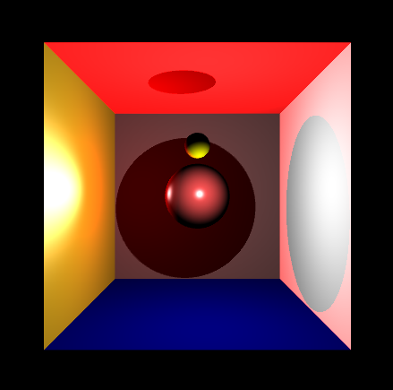

# c++ raytracer

Created a Raytracer using c++. 

Program reads a [scene description file (.txt)](https://github.com/angellam278/cpp_raytracer/blob/main/raytracer/cornell1_test.txt) and outputs a .ppm file. 

Used an online [PPM reader](https://www.cs.rhodes.edu/welshc/COMP141_F16/ppmReader.html) to read the file.
